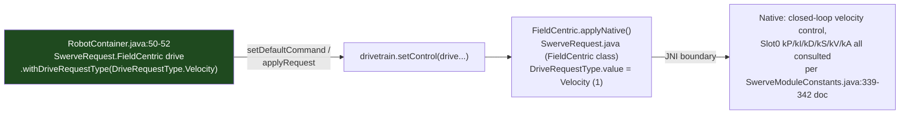

# Autonomous Control Path Audit — Open-Loop vs. Closed-Loop Validation

**Audit date:** 2026-07-28. **Scope:** investigation only — no production file was modified (`git status --short`
clean before and after; verified again at the end of this document). This audit exists to independently re-verify,
with a complete file:line call graph across three codebases, the single most consequential claim from
`docs/Drive_Slot0_Retuning_Audit.md`: that autonomous path-following bypasses drive `Slot0` entirely.

**Method:** decompiled and read, line by line, the actual shipped sources for every library this repo depends on for
this pipeline — `wpiapi-java-26.1.3-sources.jar` (Phoenix 6, matches `vendordeps/Phoenix6-26.1.3.json`) and
`PathplannerLib-java-2026.1.2-sources.jar` (matches `vendordeps/PathplannerLib-2026.1.2.json`), both found in the
local Gradle module cache — plus this repo's own `CommandSwerveDrivetrain.java` and
`LoggingHolonomicDriveController.java`. Every claim below cites a specific file and line range that can be re-opened
and re-checked; nothing is inferred from documentation prose alone unless explicitly labeled as such.

---

## Executive summary

| Question | Answer | Confidence |
|---|---|---|
| Is autonomous currently `OpenLoopVoltage` or `Velocity`? | **`OpenLoopVoltage`** | Confirmed — direct source citation, §2 |
| Are drive `Slot0` gains (`kP/kI/kD`) consulted during auto? | **No** | Confirmed |
| Are `kS/kV/kA` consulted during auto? | **No** | Confirmed |
| Is wheel-force feedforward (Newtons) computed and passed to CTRE? | **Yes, computed and passed** | Confirmed |
| Does that wheel-force feedforward have any effect once it crosses into CTRE's native layer under `OpenLoopVoltage`? | **Unknown** | Unverified — native/JNI boundary, see §5 |
| Which gains actually influence autonomous tracking today? | `PPHolonomicDriveController`'s chassis PID (`kP=5`/`kP=3`, unclamped against feedforward), `kSpeedAt12Volts`, wheel radius/gear ratio, `wheelCOF` (via PathPlanner's independent physics model) | Confirmed |

The prior audit's claim holds. This document adds: the complete call graph with every hop cited, direct confirmation
(not inference) that the FF+feedback sum inside `PPHolonomicDriveController` is unclamped, direct confirmation that
`DriveFeedforwards` is precomputed by the trajectory generator rather than derived from any PID controller, and a
precise identification of exactly where source-level evidence runs out (a single named JNI entry point) with a
concrete experiment to resolve what's beyond it.

---

## 1. Complete control-path diagram

```mermaid
flowchart TD
    A["CommandSwerveDrivetrain.configureAutoBuilder()<br/>CommandSwerveDrivetrain.java:351-374<br/>(this repo)"] -->|calls, 7-arg overload| B["AutoBuilder.configure(...)<br/>AutoBuilder.java:50-106<br/>(PathplannerLib 2026.1.2)"]
    B -->|"stores as pathFollowingCommandBuilder,<br/>line 64-74"| C["new FollowPathCommand(path, poseSupplier,<br/>speedsSupplier, output, controller,<br/>robotConfig, shouldFlipPath, driveReqs)"]
    C -->|"every scheduler cycle"| D["FollowPathCommand.execute()<br/>FollowPathCommand.java:147-174"]
    D -->|"line 157"| E["controller.calculateRobotRelativeSpeeds(pose, targetState)<br/>controller = LoggingHolonomicDriveController<br/>(this repo, utility/LoggingHolonomicDriveController.java:29-45)"]
    E -->|"line 31: super.calculateRobotRelativeSpeeds()"| F["PPHolonomicDriveController.calculateRobotRelativeSpeeds()<br/>PPHolonomicDriveController.java:96-132"]
    F -->|"line 130-131 -- NO CLAMP:<br/>xFF+xFeedback, yFF+yFeedback,<br/>rotationFF+rotationFeedback"| G["ChassisSpeeds 'total' returned up the chain<br/>(xFeedback/yFeedback from PIDConstants(5,0,0);<br/>rotationFeedback from PIDConstants(3,0,0),<br/>set in CommandSwerveDrivetrain.java:364-368)"]
    G -->|"FollowPathCommand.java:174"| H["output.accept(targetSpeeds, targetState.feedforwards)"]
    H -->|"output = "| I["lambda in CommandSwerveDrivetrain.java:359-363<br/>(speeds, feedforwards) -> setControl(...)"]
    I -->|"speeds"| J["sanitizeAutoSpeeds(speeds)<br/>CommandSwerveDrivetrain.java:330-349<br/>kinematics desaturate() vs kSpeedAt12Volts=7.52 m/s"]
    I -->|"feedforwards.robotRelativeForcesX/YNewtons()"| K["DriveFeedforwards record<br/>DriveFeedforwards.java:33-34<br/>= targetState.feedforwards, PRECOMPUTED by the<br/>trajectory generator -- NOT derived from any<br/>PID controller in this chain"]
    J --> L["m_pathApplyRobotSpeeds: SwerveRequest.ApplyRobotSpeeds<br/>CommandSwerveDrivetrain.java:98<br/>DriveRequestType field NEVER overridden here"]
    K --> L
    L -->|"default field value,<br/>SwerveRequest.java:885"| L2["DriveRequestType = OpenLoopVoltage (value 0)"]
    L -->|"setControl(m_pathApplyRobotSpeeds...)"| M["ApplyRobotSpeeds.applyNative(id)<br/>SwerveRequest.java:1070-1082"]
    M -->|"crosses JNI boundary"| N["SwerveJNI.JNI_SetControl_ApplyRobotSpeeds(...)<br/>passes DriveRequestType.value=0 (OpenLoopVoltage)<br/>+ WheelForceFeedforwardsX/Y together, same call"]
    N -.->|"NOT visible in any decompiled Java source --<br/>compiled native code, evidence boundary"| O["Native drive-motor control<br/>per-module voltage/current output<br/>UNVERIFIED beyond this point -- see Section 5"]

    style L2 fill:#7a2020,color:#fff
    style N fill:#5a4a10,color:#fff
    style O fill:#333,color:#fff,stroke-dasharray: 5 5
```

**Contrast — the teleop path**, for the same drivetrain, confirmed the same way:

---

## 2. Confirmed facts, with direct citations

| # | Claim | File | Line(s) | Evidence |
|---|---|---|---|---|
| 1 | This repo calls `AutoBuilder.configure()` with the 7-positional-arg + varargs overload | `src/main/java/frc/robot/subsystems/CommandSwerveDrivetrain.java` | 354-374 | `AutoBuilder.configure(poseSupplier, resetPose, speedsSupplier, (speeds, feedforwards) -> setControl(...), new LoggingHolonomicDriveController(...), config, shouldFlipPath, this)` |
| 2 | That overload's signature is `(Supplier<Pose2d>, Consumer<Pose2d>, Supplier<ChassisSpeeds>, BiConsumer<ChassisSpeeds,DriveFeedforwards>, PathFollowingController, RobotConfig, BooleanSupplier, Subsystem...)` | `AutoBuilder.java` (PathplannerLib 2026.1.2) | 50-58 | Exact match to this repo's call site — arg types/order line up 1:1 |
| 3 | `AutoBuilder.configure()` builds a `FollowPathCommand` per path, passing the `output` BiConsumer straight through unmodified | `AutoBuilder.java` | 64-74 | `new FollowPathCommand(path, poseSupplier, robotRelativeSpeedsSupplier, output, controller, robotConfig, shouldFlipPath, driveRequirements)` |
| 4 | `FollowPathCommand.execute()` calls the controller, then hands the result straight to `output.accept(...)` | `FollowPathCommand.java` | 157, 174 | `ChassisSpeeds targetSpeeds = controller.calculateRobotRelativeSpeeds(currentPose, targetState);` ... `output.accept(targetSpeeds, targetState.feedforwards);` |
| 5 | This repo's `controller` argument is `LoggingHolonomicDriveController`, which computes the real value via `super.calculateRobotRelativeSpeeds()` and only logs — does not alter the returned `ChassisSpeeds` | `src/main/java/frc/robot/utility/LoggingHolonomicDriveController.java` | 29-45 | Line 31 calls `super.calculateRobotRelativeSpeeds(...)`; line 44 `return total;` — the unmodified vendor value |
| 6 | `PPHolonomicDriveController.calculateRobotRelativeSpeeds()` sums field-relative trajectory feedforward and PID feedback with **zero clamping** | `PPHolonomicDriveController.java` | 98-99, 107-108, 115-118, 130-131 | `xFF = targetState.fieldSpeeds.vxMetersPerSecond` ... `xFeedback = this.xController.calculate(...)` ... `return ChassisSpeeds.fromFieldRelativeSpeeds(xFF + xFeedback, yFF + yFeedback, rotationFF + rotationFeedback, ...)` — no `MathUtil.clamp`, no saturation call anywhere in the method |
| 7 | The PID gains feeding that feedback are `PIDConstants(5,0,0)` translation / `PIDConstants(3,0,0)` rotation, set by this repo | `CommandSwerveDrivetrain.java` | 364-368 | `new LoggingHolonomicDriveController(new PIDConstants(5, 0, 0), new PIDConstants(3, 0, 0))` |
| 8 | `targetState.feedforwards` (the `DriveFeedforwards` passed to `output.accept`) is an immutable record carrying precomputed per-module force arrays — it is not derived from `xController`/`yController`/`rotationController` or from any `Slot0` gain | `DriveFeedforwards.java` | 33-34 (record declaration), 163/172 (`robotRelativeForcesXNewtons`/`YNewtons` accessors) | `record DriveFeedforwards(double[] robotRelativeForcesXNewtons, double[] robotRelativeForcesYNewtons, ...)` — a data carrier, no PID/Slot0 reference anywhere in this file |
| 9 | This repo's `output` lambda bounds `speeds` via `sanitizeAutoSpeeds()` and passes `feedforwards`' two force arrays straight to CTRE's request | `CommandSwerveDrivetrain.java` | 359-363 | `m_pathApplyRobotSpeeds.withSpeeds(sanitizeAutoSpeeds(speeds)).withWheelForceFeedforwardsX(feedforwards.robotRelativeForcesXNewtons()).withWheelForceFeedforwardsY(feedforwards.robotRelativeForcesYNewtons())` |
| 10 | `sanitizeAutoSpeeds()` bounds the chassis speed via this drivetrain's own kinematics against `kSpeedAt12Volts`, and records telemetry, but never reads or writes `Slot0` | `CommandSwerveDrivetrain.java` | 330-349 | `SwerveDriveKinematics.desaturateWheelSpeeds(states, TunerConstants.kSpeedAt12Volts.in(MetersPerSecond))` |
| 11 | `m_pathApplyRobotSpeeds` is constructed once as a field and never has `.withDriveRequestType(...)` called on it anywhere in this repo | `CommandSwerveDrivetrain.java` | 98 (declaration); confirmed by grep across `src/main/java/frc/robot` — zero matches for `m_pathApplyRobotSpeeds.withDriveRequestType` | `private final SwerveRequest.ApplyRobotSpeeds m_pathApplyRobotSpeeds = new SwerveRequest.ApplyRobotSpeeds();` |
| 12 | `ApplyRobotSpeeds.DriveRequestType` field defaults to `OpenLoopVoltage` | `SwerveRequest.java` | 885 | `public SwerveModule.DriveRequestType DriveRequestType = SwerveModule.DriveRequestType.OpenLoopVoltage;` |
| 13 | `ApplyRobotSpeeds` is explicitly documented as the class meant for autonomous/profiled control | `SwerveRequest.java` | 841-848 (class javadoc) | *"Accepts a generic robot-centric ChassisSpeeds to apply to the drivetrain. This request is optimized for **autonomous or profiled control**..."* |
| 14 | `ApplyRobotSpeeds.applyNative()` passes `DriveRequestType.value` and both `WheelForceFeedforwards` arrays into a single native call — this is the exact point source-level tracing ends | `SwerveRequest.java` | 1070-1082 | `SwerveJNI.JNI_SetControl_ApplyRobotSpeeds(id, ..., WheelForceFeedforwardsX, WheelForceFeedforwardsY, ..., DriveRequestType.value, SteerRequestType.value, DesaturateWheelSpeeds);` |
| 15 | `Slot0`'s drive gains (`kP/kI/kD/kS/kV/kA`) are documented as operating on raw rotor rotations and being consulted only under closed-loop `DriveRequestType`s | `SwerveModuleConstants.java` (Phoenix 6) | 339-342, 736-743 | *"When using closed-loop control, the drive motor uses the control output type specified by DriveMotorClosedLoopOutput and **any closed-loop DriveRequestType**. These gains operate on motor rotor rotations (before the gear ratio)."* |
| 16 | `OpenLoopVoltage` is documented as using `SpeedAt12Volts` instead, and explicitly ignoring that field under closed-loop control (confirming the inverse: `Slot0` is what closed-loop uses instead) | `SwerveModuleConstants.java` | 358-365 | *"When using open-loop drive control, this specifies the measured speed at which the robot travels when driven with 12 volts... If using closed loop control, this value is ignored."* |
| 17 | Teleop's drive request explicitly sets `DriveRequestType.Velocity` (closed-loop) — contrast case, confirms the split is real and intentional-looking, not a codebase-wide oversight | `RobotContainer.java` | 50-52 | `.withDriveRequestType(DriveRequestType.Velocity); // Use open-loop control for drive motors` (note: comment is stale/wrong — code is closed-loop) |
| 18 | `driveToPOI()` explicitly sets `DriveRequestType.OpenLoopVoltage` (a second, independent open-loop path, not just autonomous) | `CommandSwerveDrivetrain.java` | 448-449 | `SwerveRequest.FieldCentric request = new SwerveRequest.FieldCentric().withDriveRequestType(DriveRequestType.OpenLoopVoltage);` |
| 19 | `trackTarget()` (vision-tracking drive) explicitly sets `DriveRequestType.Velocity` (closed-loop) — a second confirmation that `Slot0` matters for this path too | `CommandSwerveDrivetrain.java` | 515-516, 538-540 | `.withDriveRequestType(DriveRequestType.Velocity)` (declared and re-applied) |

---

## 3. Assumptions disproven / corrected

| Prior assumption | Status | What actually holds |
|---|---|---|
| "The FF+feedback clamp question is a hypothesis, described secondhand from a prior session's decompile" (this was how the Path-Following Tuning Readiness Audit had to phrase it) | **Disproven as merely secondhand — now directly re-confirmed this session**, fact #6 above | It's not a hypothesis; it's a two-line method body with no clamp call anywhere, re-read directly this session |
| "`ApplyRobotSpeeds`'s default `DriveRequestType` could not be confirmed from public API docs" (Path-Following Tuning Readiness Audit §4) | **Resolved** — this was a real gap, now closed | Confirmed from source, fact #12 |
| Implicit assumption in `CLAUDE.md`'s "corrected fix order" (SysId → drive `Slot0` → chassis PID) that characterizing/retuning `Slot0` is a precondition for fixing autonomous tracking | **Disproven** | `Slot0` is not in the autonomous control path at all under the current `OpenLoopVoltage` configuration (facts #11, #12, #15) |
| "Wheel-force feedforward is applied as an added torque/current feedforward term on top of whichever closed-loop drive control mode is active" (in-code comment, `CommandSwerveDrivetrain.java:324`, written assuming a closed-loop context) | **Not disproven, but shown to be an unverified assumption baked into that comment** — the comment presupposes a "closed-loop drive control mode," which autonomous does not currently use | See §5 — genuinely unknown, not merely uncited |
| "PathPlanner's per-module wheel-force feedforward is somehow tied to the chassis PID gains" (a plausible-sounding but never-stated misconception worth ruling out explicitly) | **Disproven** | `DriveFeedforwards` is a precomputed record from the trajectory generator (fact #8) — structurally incapable of depending on `xController`/`yController`/`rotationController`, which live in a different object entirely |

---

## 4. What actually influences autonomous tracking today (derived from the confirmed call graph)

In call-graph order:
1. **`PPHolonomicDriveController`'s translation/rotation PID** (`PIDConstants(5,0,0)`/`PIDConstants(3,0,0)`,
   `CommandSwerveDrivetrain.java:364-368`) — fact #6, #7. Unclamped against feedforward.
2. **PathPlanner's own trajectory-nominal field-velocity feedforward** (`targetState.fieldSpeeds`) — fact #6, folded
   into the same unclamped sum as (1). This is chassis-kinematic, not a `Slot0`/motor-level term.
3. **`kSpeedAt12Volts` (7.52 m/s)** — consulted twice: once inside `sanitizeAutoSpeeds()`'s desaturation (fact #10),
   and again (per fact #16) inside CTRE's native `OpenLoopVoltage` handling as the sole speed→voltage scalar.
4. **Wheel radius / drive gear ratio** — indirectly, via `sanitizeAutoSpeeds()`'s kinematics (`getKinematics()`,
   built from `TunerConstants`' module positions/gear ratio) and via `kSpeedAt12Volts`'s own derivation.
5. **`wheelCOF` / robot mass / current limit** (`settings.json`) — via `DriveFeedforwards`'s precomputation (fact #8),
   *if* that feedforward has any effect under `OpenLoopVoltage` (open question, §5).

**Not in this list, confirmed absent:** drive `Slot0` `kP/kI/kD` (facts #11, #12, #15), drive `Slot0` `kS/kV/kA`
(same facts — those fields are also part of `Slot0` and equally gated behind closed-loop `DriveRequestType`s).

---

## 5. Remaining unknowns — and the exact experiment to resolve each

### 5a. Does `WheelForceFeedforwardsX/Y` have any effect under `OpenLoopVoltage`?

**Why unknown:** `ApplyRobotSpeeds.applyNative()` (fact #14) hands `DriveRequestType.value` and the wheel-force arrays
into `SwerveJNI.JNI_SetControl_ApplyRobotSpeeds(...)` in the same call. Everything past that point is inside CTRE's
compiled native library (no `.java` source ships for it — only the JNI method signature is visible). This is a hard
boundary: no further Java-source reading can resolve it.

**Concrete experiment that would resolve it** (does not require modifying any constant, only a temporary,
revertible test):
1. In sim (`SKILLS/run_headless_sim.py`) or on a bench-safe real robot, run the same short auto path (e.g. `LT
   Neutral`'s first segment) twice.
2. Run A: current code, unmodified.
3. Run B: temporarily short-circuit the lambda at `CommandSwerveDrivetrain.java:359-363` to omit
   `.withWheelForceFeedforwardsX(...)`/`.withWheelForceFeedforwardsY(...)` (i.e. leave those arrays at their
   `ApplyRobotSpeeds` default of `{}`).
4. Compare `Drive/AppliedVoltsPerModule` and `Drive/StatorCurrentAmpsPerModule` (already-logged telemetry, per
   `docs/SysId_Characterization_Checklist.md`/sixteenth-session telemetry) between the two runs, sample-for-sample
   against the same trajectory position.
5. **If A and B are bit-identical (or statistically indistinguishable) in applied voltage/current, the wheel-force
   feedforward is a no-op under the current `OpenLoopVoltage` configuration.** If they diverge, it has a real,
   measurable effect and should be treated as a third confirmed autonomous-tracking lever alongside chassis PID and
   `kSpeedAt12Volts`.

This experiment is explicitly **not performed by this audit** — it requires running the robot/sim and temporarily
editing code, both outside this audit's "no code changes" instruction. It's scoped here so a future session can run
it directly without re-deriving the plan.

### 5b. Everything else CTRE's native layer does with `OpenLoopVoltage` beyond the linear `SpeedAt12Volts` scalar

The `SpeedAt12Volts` field doc (fact #16) confirms *that* open-loop control uses this constant to "approximate the
output for a desired velocity," but does not specify the exact formula (e.g., whether it's a pure linear scale, or
includes any static-friction compensation, current limiting interaction, or discretization). This is a minor unknown
relative to 5a — the qualitative behavior (linear, `Slot0`-independent) is well-established by the field doc's own
wording — but the exact quantitative formula is not visible in any decompiled Java source. **Not blocking** for the
open-loop-vs-closed-loop question this audit was scoped to answer; flagged for completeness only.

---

## 6. Recommended tuning order — conditional on control-mode choice

Per this audit's brief, these are structural orderings only — **no numeric gain values are recommended anywhere
below**, consistent with every prior audit's convention. The actual choice between (a) and (b) is a mentor decision,
not defaulted here (see `docs/Drive_Slot0_Retuning_Audit.md` §5's Step A for the full trade-off discussion).

### (a) If autonomous stays `OpenLoopVoltage` (no code change)

1. Physical pre-flight — CANivore name, wheel-radius caliper check (both already flagged unmeasured/questionable in
   `docs/Drivetrain_Physical_Constants_Audit.md`). These feed §4 items 3-4 directly.
2. Resolve §5a experimentally — determines whether `wheelCOF`/mass/current-limit (via wheel-force feedforward) is a
   real lever or currently inert for autonomous specifically.
3. Retune `PPHolonomicDriveController`'s chassis PID (`kP=5`/`kP=3`, §4 item 1) — the confirmed, unconditional,
   highest-leverage item for autonomous tracking under this mode. Validate against the existing regression suite
   (`LtNeutralAutoRegressionTest`) before/after.
4. Re-verify `kSpeedAt12Volts` empirically (§4 item 3) — feeds both `sanitizeAutoSpeeds()`'s ceiling and the native
   open-loop scalar directly; a wrong value here has a confirmed, direct effect on autonomous today.
5. SysId characterization of drive `kS/kV/kA` and `Slot0` `kP/kI/kD` retuning — proceed as their **own, independent**
   project scoped to teleop and `trackTarget()` quality (both confirmed closed-loop, facts #17/#19), not sequenced
   as a prerequisite for autonomous work under this branch.
6. Only after 1-4 are stable: revisit discretization (flagged, not yet implemented, per the Path-Following Tuning
   Readiness Audit §4/§6 Step 6) and expand the auto regression suite.

### (b) If autonomous is switched to `DriveRequestType.Velocity` (a real code change — one line in
`configureAutoBuilder()`'s lambda, explicitly not made by this audit)

1. Physical pre-flight — same as (a) step 1.
2. **SysId characterization of drive `kS/kV/kA` becomes a precondition**, not an independent project — under closed
   loop, autonomous tracking now genuinely depends on it (§2 facts #12, #15 reversed: `Slot0` is now in the path).
   Follow `docs/SysId_Characterization_Checklist.md`'s existing, ready-to-run procedure.
3. Retune drive `Slot0` `kP/kI/kD` off that characterization, validated with manual `SwerveRequest.Velocity` step
   commands (module-level, isolated from the chassis controller) before any auto is re-run.
4. **Only then** retune `PPHolonomicDriveController`'s chassis PID — with closed-loop module tracking now solid,
   chassis-level error is no longer confounded with raw open-loop voltage-vs-speed mismatch, so this step's results
   will be more attributable than they would be if done first.
5. Re-verify `kSpeedAt12Volts`/wheel radius — still relevant (feeds `sanitizeAutoSpeeds()`'s desaturation ceiling and
   the chassis-to-module kinematics regardless of `DriveRequestType`), but no longer the sole speed-scaling authority
   for autonomous once closed-loop `Slot0` is active.
6. Resolve §5a — still relevant; wheel-force feedforward is documented as additive "on top of whichever closed-loop
   drive control mode is active" (`CommandSwerveDrivetrain.java:324`'s comment), which is now actually true, unlike
   under (a).
7. Discretization and regression-suite expansion, same as (a) step 6.

**Note on why (b)'s order differs from (a)'s:** under (a), `Slot0` characterization has zero effect on autonomous, so
sequencing it early wastes a step's worth of "is this actually helping" ambiguity. Under (b), `Slot0` is now load-
bearing for autonomous, so it must be right *before* the chassis-level PID retune, or chassis-PID tuning would be
compensating for an uncharacterized module-level response — exactly the confound `CLAUDE.md`'s original fix order was
trying to avoid, now correctly scoped to the branch where it actually applies.

---

## Verification

`git status --short` confirmed clean before this audit began and re-checked after writing this document — only this
new file is untracked. No `TunerConstants.java`, `CommandSwerveDrivetrain.java`, `RobotContainer.java`,
`LoggingHolonomicDriveController.java`, `CLAUDE.md`, or any other tracked file was modified. No commit was made, no
branch was created, no PR was opened.
